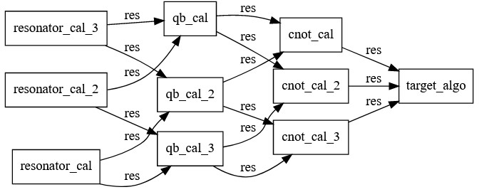

# Examples

## Programmatically generating a graph

In the following example we show how to build a graph from repeated blocks and to connect them programmatically. 
This is representative of a workflow where the user calibrates some elements, possibly a resonator and a qubit in a 
cavity QED context, and then executes a target algorithm. 

We first generate the experiment resources and set up the functions each node will execute. 
These function can take `context:EntropyContext` as a parameter if the user wishes for them to have access to the experiment 
resources, but this is not mandatory. 
```python
from entropylab import *
db = SqlAlchemyDB(path='.')
labResources = ExperimentResources(db)


def calibrate_resonator(context:EntropyContext):
    return {'res': [1, 2, 3, 6]}

def calibrate_qubit():
    return {'res': [1, 2, 3, 6]}
def calibrate_cnot():
    return {'res': [1, 2, 3, 6]}
def target_algo():
    return {'res': [1, 2, 3, 6]}
```

Next, we can set up lists to which we append nodes of each type. The connectivity between nodes is simply setup in a loop. 
You can change the `qb_num` parameter to produce graphs of differing sizes. 
```python
qb_num = 3
res_nodes = []
qb_nodes = []
cnot_nodes = []
for ind in range(qb_num):
    res_nodes.append(PyNode(label=f"resonator_cal", program=calibrate_resonator, output_vars={'res'}))
for ind in range(qb_num):
    qb_nodes.append(PyNode(label=f"qb_cal", program=calibrate_qubit, output_vars={'res'}, input_vars={'x': res_nodes[ind].outputs["res"],
                                                                                                      'y': res_nodes[(ind+2)%qb_num].outputs["res"]}))

for ind in range (qb_num):
    cnot_nodes.append(PyNode(label=f"cnot_cal", program=calibrate_cnot, output_vars={'res'}, 
                             input_vars={'C': qb_nodes[ind].outputs["res"],
                                         "T":qb_nodes[(ind+1)%qb_num].outputs["res"]
                                        }
                            )
                     )
tgt_inputs = {}
for idx,node in enumerate(cnot_nodes):
    tgt_inputs[f"{idx}"] = node.outputs["res"]


tgt_node  = PyNode(label=f"target_algo", program=target_algo, output_vars={'res'},input_vars=tgt_inputs)
    
experiment = Graph(resources=labResources, graph={*res_nodes, *qb_nodes,*cnot_nodes,tgt_node}, story="run_a",label="multi node")
experiment.run()

experiment.dot_graph()
```

For `qb_num=3` the output graph is as follows: 




## Using external devices in a node

Using external devices in an Entropy node is done via the EntropyContext. 
User associate a resource to the entropy labResources database, either permanently or temporarily, and then use them inside nodes. 

The first step is to write an instrument driver. This can inherit from `Resource` but that's not a hard requirement. 
An example mock driver is shown below:

```python

from entropylab.instruments.instrument_driver import Resource

class MockScope(Resource):
    def __init__(self, address: str, extra: str, **kwargs):
        super().__init__(**kwargs)
        self.index = 0
        self.address = address
        self.extra = extra

    def connect(self):
        
        print('Connected!')

    def teardown(self):
        pass

    def get_trig(self):
        self.index += 1
        print(f"got trig {self.index}")

    def snapshot(self, update: bool) -> str:
        return str(self.index)

    def revert_to_snapshot(self, snapshot: str):
        self.index = int(snapshot)

```

This driver can then be associated with the lab resources. Below is an example of doing this temporarily, on a per-experiment basis. 
```python
db = SqlAlchemyDB(path='.')
labResources = ExperimentResources(db)
labResources.add_temp_resource(
    "scope_1", MockScope("1.1.1.1", "")
)
```
You then write the experiment node functions in the regular way, passing the `context` to each node that needs to have instrument access.

```python
 
def work_with_scope(context: EntropyContext):
    scope = context.get_resource('scope_1')
    scope.connect()
    scope.get_trig()
    return {'res': [0, 1, 2, 3, 4]}

def work_with_scope_again(context: EntropyContext):
    scope = context.get_resource('scope_1')
    scope.connect()
    scope.get_trig()
    
    return {'res': [0, 1, 5, 3, 4]}


node1 = PyNode(label="first_node", program=work_with_scope, output_vars={'res'})
node2 = PyNode(label="first_node", program=work_with_scope_again, output_vars={'res'})
experiment = Graph(resources=labResources, graph={node1,node2}, story="a scope", label='experiment with instruments')
handle = experiment.run()
```


