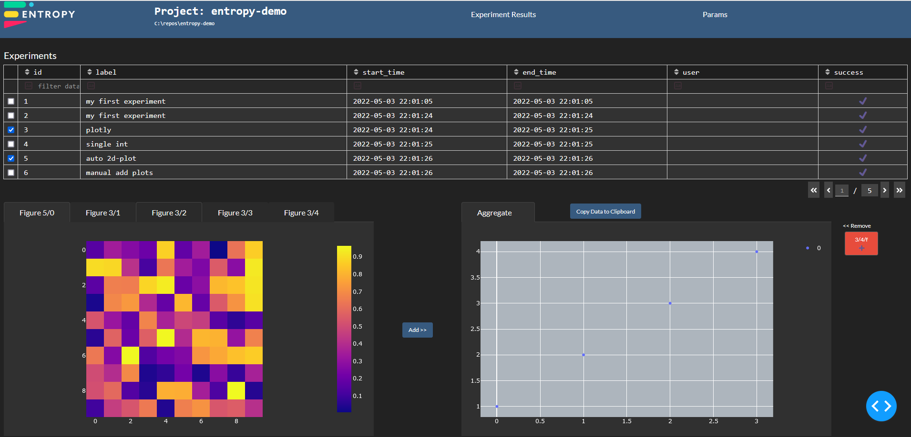
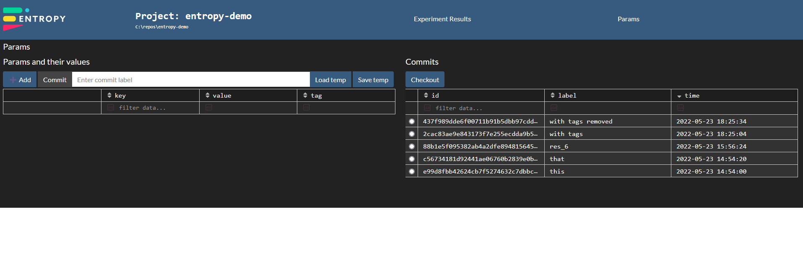

# Entropylab Web GUI
The results GUI is a web interface for viewing measurement results. To access the GUI, open the command line and `cd` 
into a valid entropy project directory (or into your desired working directory, even if it's not currently an entropy project). 
Typing `entropy serve ↩` will bring up a webserver with the GUI. You can now view the application by starting any web browser  
and navigating to `localhost:8050`.

# The Results Dashboard
The main window of the application is the results dashboard. 

Here you can view any plot associated with experiments that were run and saved to the database. 
The table shows any results currently in the DB and is periodically updated to show results of experiments that were recently 
completed. 
Note the pagination control located in the bottom right corner of the table as only a limited number of experiments is shown per 
screen.

The table can be filtered through any of its columns. Advanced filtering syntax can be found [here](https://dash.plotly.com/datatable/filtering).

 

### Dashboard `--debug` option

The web GUI has an error logging option. This is triggered by serving the dashboard with `entropy serve --debug`. 
Doing this generates a fairly verbose log file in the `.entropy` folder. 

## ParamStore dashboard

The ParamStore is a database used to save and retrieve experimental parameters. See more in the appropriate section of this 
documentation site. 
If there is a ParamStore file in the `.entropy` directory, then the paramstore can be interacted with from the params GUI. 
This is opened via the "Params" link on the header row.

On the left-hand side there is a table with the current key-value-tag entries present in the store. 
Each row (key) can be removed using the "x" button on the left most part of the table. 
New keys can be added using the "Add" button. 
If a store state is modified, but not committed, a "dirty" indicator should appear. 
This indicator disappears if the store is committed using the "Commit" button. A commit label can be added prior to committing. 
The `load temp`, `save temp` buttons perform a commit operation to a special commit id. This is identical to committing, but there is 
only one `temp` state. 

The right-hand table is used to check out commits. Using the radio button select a commit and push the `Checkout` button. 
The params table on the left should update accordingly. 

 
