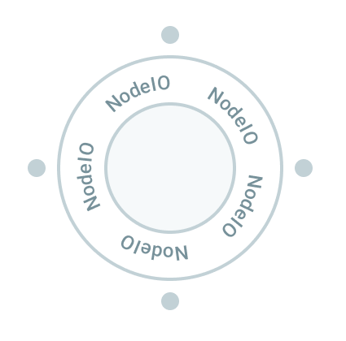

# NodeIO

{ align=right width=200}

NodeIO wraps your code — that provides a solution using some experimental
hardware or does some calculations — written in almost any language. We call
that solution _a node_, and NodeIO provides a universal interface to your
solution. Taking NodeIO in the flavour of your language of choice, you can
**individually test** your solution (modularity) before **immersing it in a
bigger workflow**, for which NodeIO provided an interface without any additional
work from your side. Crucially, through inputs and outputs provided by NodeIO
your solution can **trigger, pass and react to events, data and states** in
other nodes in the workflow. Thanks to NodeIO you explain all of these in a way
that closely follows how we humans think, as a story that happens.

!!! Note

        When using EntropyHub, code for nodes and workflows can be edited in
        **Experiments** panel with **Code** view turned on.

## Example of node definition

Before looking in details, let's see an example:

=== "Python"

    ```python
    # ==================== DEFINE NODE ====================
    import entropylab.flame.nodeio as nodeio

    nodeio.context(
    name="HelloWorld",
    description="example node that concatinates strings",
    icon="bootstrap/gear-fill.svg"
    )

    inputs = nodeio.Inputs()
    inputs.flow("new_value", units="",
    description="what to add to cummulative sum")

    outputs = nodeio.Outputs()
    outputs.define("cumulative_sum", units="",
    description="string after concatination", retention=0)

    nodeio.register()

    # ==================== DRY RUN DATA ====================

    inputs.set(new_value = "Hello")
    inputs.set(new_value = " world")
    inputs.set(new_value = "!")

    # =============== RUN NODE STATE MACHINE ===============

    current_string = ""

    while nodeio.status.active:
        outputs.set(cumulative_sum = current_string)
        print(current_string)
        increment = inputs.get("new_value")
        current_string += increment
    ```

=== "QUA"

    ```python
    # TO-DO
    ```

=== "C++"

    ```cpp
    #include <stdio.h>

    int main(void) {
    printf("TO-DO!\n");
    return 0;
    }
    ```

=== "LabView"

    TO-DO

We see the code has in general three parts: 1. node and I/O definition, 2.
dry-run data and 3. user-defined logic that works within a state-machine loop.
Looking closely to example you see that:

3. First we use the `nodeio` library to **define node name**, used for creating
   instances of this node when building workflows later. Also, we specify
   description of the node, and select an icon for visualisation in the workflow
   view. After that we grab an instance of `nodeio.Inputs()` and use it to
   **define names of inputs**, specifying optional units and some useful
   description. Here we use the so-called `flow` variable that we will discuss
   below. Think about them as a water pipe, they queue all received inputs for
   the node to be consumed in sequential manner. Then we grab an instance of
   `nodeio.Outputs()` and use it to **define names of outputs**. Additional
   key-word argument `retention` will specify now if we need this output just
   temporarily, as run-time variable only, or we also want to save it forever,
   as a result. Importantly, at the end of this segment we call
   `nodeio.register()` which will **register this node** as something we can use
   later on in building workflows.

4. The second segment defines so-called **dry-run data**. This is used for
   specifying example inputs of the node, and allows testing and debugging of
   the node during development of the node, independent of any workflows. It is
   also used to specify expected data-types for the inputs, which in case of
   Python is done implicitly. In this specific example, we set the flow variable
   3 times. Since this is a flow variable, the `input.get` function called later
   for this variable will return these three different values in sequence they
   were passed to it.

5. Finally, in the third, and the last part, we have user-defined logic for
   solving specific problems. Importantly, after any initial variable
   initialisation, all the logic is happening within **state-machine loop**
   defined by `nodeio.status.active`. One breaks out of the loop pressing
   ++ctrl+c++, or the program will on its own leave the loop if some of the
   requested flow variables is empty. During the running, execution relative to
   other nodes is controlled by setting outputs and getting inputs. For example,
   If a node is run as a part of a workflow, `input.get()` will block on flow
   variables until value is received from some other node.

If we run above code in terminal the output will be

```
Hello
Hello world
Hello world!
```

When running node like this, outside a workflow (dry-run), not only that we
check the functioning of the node, but also on the background the necessary node
information is added in the automatically-generated folder `entropynodes` that
can be used later on to construct workflows.

**What data types we can pass as inputs/outputs?** To keep this interoperability
between different programing languages, node inputs and outputs can be a `int`,
`float`, `string` or generic `json`. JSON can be used to pass any other datatype
by serializing it beforehand.

We will now look in detail at the options and functionality of `nodio` inputs
and outputs.

## Node inputs

Communication between nodes is asynchronous, and different types of input
variables handle differently updates to the inputs. Choosing appropriate input
can help you easily write solutions for real-time control with many nodes. With
each node input type we provide some typical use cases to help you with
selection.

### :nodeio-state: State

A **state input** saves only the last value passed to it. Requesting multiple
times the value of state input always returns the latest existing value, no
metter how many times the new value has been set since the last `get(...)` call.
The `get(...)` call blocks (waits) for value only if the value has not yet been
set. A state input It is defined with

=== "Python"

    ```python
    inputs.state("temperature", units="C",
    description="sensor reading of outside temperature")
    ```

=== "C++"

    ```cpp
    \\ TO-DO
    ```

**Value can be obtained with**

=== "Python"

    ```python
    value = inputs.get("temperature")
    ```

=== "C++"

    ```cpp
    \\ TO-DO
    ```

And this request will return the latest set value, unless the value has not been
set yet, in which case it will block (wait) until it is set. We can use method
`updated(...)` to **check if the value has been updated** since the last time we
have read it

=== "Python"

    ```python
    if inputs.updated("temperature"):
        print("temperature value has been set again on input")
    else:
        print("no updates received")
    ```

=== "C++"

    ```cpp
    \\ TO-DO
    ```

This always returns immediately. Note that `updated` returns `True` even if the
same value has been set again (it does not compare with previous value).

Some use cases are

=== "Providing latest real-time parameters :material-beaker-question-outline:"

    Imagine you have some process :robot: that continuously does analysis of
    available data about your system and updates some value estimate. The value
    might be describing best current treshold for discriminating between two states
    for example. Some other part of your system :person_red_hair: has to use this
    knowledge. That part of the system does not care how many updates have been made
    to the parameter in the meantime by :robot:. All :person_red_hair: wants to do
    is to use the latest/best available value, while working independently of the
    :robot:. Connecting :robot: output as state input for :person_red_hair: is a
    perfect solution.

=== "Pipelines for real-time data :material-eye-outline:"

    Imagine you have a camera :camera_with_flash: taking images of something at 30
    fps. This is images are used for several different purposes in the system. Now
    you want to add to this a special image processing module :face_with_monocle:.
    However due to heavy processing, your :face_with_monocle: can handle just 20 fps
    on average. To make best use of the real-time system, you would like to feed to
    the rest of the system the most up-to-date analysis from the :face_with_monocle:
    module, so you might need to periodically drop some of the frames. For this
    connecting :camera_with_flash: output to state input of :face_with_monocle: is a
    perfect solution.

### :nodeio-flow: Flow

A **flow input** queues all received values for sequential consumption one by
one. Each `.get(...)` then returns (consumes) one value from the queue. In case
the queue is empty, `get(...)` queue will block (wait).

=== "Python"

    ```python
    inputs.flow("movement_detected", units="my units for movement detection",
    description="details of detected movement")
    ```

=== "C++"

    ```cpp
    \\ TO-DO
    ```

**Value can be obtained** same as with any other input

=== "Python"

    ```python
    value = inputs.get("movement_detected")
    ```

=== "C++"

    ```cpp
    \\ TO-DO
    ```

If the queue is empty this will block (wait) until something sets the input.
Repeated calls to `get(...)` on flow variables return in sequence items from the
queue in the order they are received (queue is consumed in order). Sometimes one
might just want to check if the new value on the flow input is provided, without
blocking the `get(...)` call. That is provided by `updated(...)` method

=== "Python"

    ```python
    if inputs.updated("movement_detected"):
        print("New movement has been detected. Details of the movement:")
        details = inputs.get("movement_detected")
        print(details)
    else:
        print("no movement detected")
    ```

=== "C++"

    ```cpp
    \\ TO-DO
    ```

This always returns immediately, returning `True` only if there is a value in
the flow input queue ready to be consumed with `get(...)`.

Some use cases are

=== "Event triggering :octicons-zap-16:"

    Imagine you want to trigger e.g. camera :camera_with_flash: on movement
    :material-motion-sensor:. You can solve this by having a camera node that will
    initialize a camera and wait on flow input channel, connected to node
    :material-motion-sensor: that does motion detector analysis maybe based on some
    sensors, to trigger an event :octicons-zap-16:.

=== "Data pipeline/queue :material-human-queue:"

    Imagine you have a chain of data analysis nodes (:woman:, :man_cook:, :man_mage:
    , :woman_fairy:, ...) operating in sequence on a given data. You can pass these
    data tasks from one node to another using flow inputs. :woman: :nodeio-flow:
    :man_cook: :nodeio-flow: :man_mage: :nodeio-flow: :woman_fairy:.

    Note in case that you data producers are faster than data consumers, the data
    buffer will be growing, occupying memory. If data production is not naturally
    limited within the system, unlimited amounts of data can be produced over time,
    while the consumer is limited in ingestion. Then the buffer would request
    ever-growing memory in this case. This unlimited memory cannot be provided of
    course. To handle such cases please check the note below.

??? Note "Note: what to do when producer is faster than consumer"

    Note that simple flow input does not provide **back-pressure** on producers.
    That is, if producer is producing output at rate larger than the input node
    consumption on flow input, the data will be saved in memory, which will grow
    over time. You don't want to allow uncontrolled growth of data in the memory, so
    in case the maximum number of submitted jobs to the pipeline is not somehow
    naturally limited in the system, you have to consider how to do this. In this
    situation you can, depending on your problem, either:

    - choose that consumer should drop excessive data (using state variable as
    consumer input instead of flow variable);
    - apply some "back-pressure" mechanism that will block producer from sending
    more data until there is new capacity for consumption; or
    - in case you need all data, you don't want to slow producer by applying
    back-pressure, and data cannot be fitted in the memory, you can let either
    producer or consumer store it in large enough memory (database/disk). For
    example producer can be storing it in memory, and it can pass just file/memory
    pointers to the consumer as job specifications.

    One approach to apply back pressure is using the idea of **credit**. The
    Producer has credit of say `10` with a given consumer. Every time it outputs a
    job for a consumer reduces that credit by one. Every time a consumer finishes a
    job it returns `+1` credit on the flow variable of the producer. If it produces
    positive credit with a given consumer it can send a job, otherwise it must wait
    to collect all received credits from it's own flow input receiving credits back
    from the consumer.

## Node outputs

Outputs of the nodes serve many purposes: triggering events, passing data,
saving results... They are defined simply as

=== "Python"

    ```python
    outputs.define("outside_temperature", units="C",
    description="measured with I2C sensor", retention=2)
    ```

=== "C++"

    ```cpp
    \\ TO-DO
    ```

Key thing to consider when defining an output is **retention**: do we need this
value just during run-time as for use by other nodes, to keep it temporarily
while we keep an eye on experiment execution, or want to keep it forever as the
result in the experiment record? You specify this by setting corresponding
retention value:

### :nodeio-runtime: Runtime retention

`retention=0` means that this output is available only to other nodes during
running of the workflow.

### :nodeio-temp: Temporary retention

`retention=1` in addition to making output available for potential use by other
nodes, it also stores it temporarily in the runtime database. Output values in
the runtime database can be shown for example in dashboard. They are saved until
the next job is run on the runtime.

This is useful for values one wants to keep an eye on durig the execution of the
workflow, but does not need to be saved forever as experimental record.

### :nodeio-forever: Forever retention

`retention=2` in addition to making value available to other nodes and in the
runtime database, this outputs are saved forever in the final output datafile.

This is useful for results of the experiment, and anything else that should be
saved in a persistant record.

### Setting the output

You **set the output value** with

=== "Python"

    ```python
    outputs.set(outside_temperature = 25.2)
    ```

=== "C++"

    ```cpp
    \\ TO-DO
    ```

Just as with inputs, the outputs can be `int`, `float`, `string` or anything
else that is correct JSON dictionary.

All outputs can be set as many times as you wish. For retention value `1-2`,
they will be visible as time-series in the database and as an array in the hdf5
file.

## Testing individual nodes

Key requirements when building complex, expensive setups is the ability to
develop and test nodes independently on their own (**modularity requirement**),
before immersing them in the more complex workflow. This is easily done by using
**dry-run data** supplied to the inputs of the nodes before the main node state
loop. This data is used only if the node is running outside of the workflow, and
based on this test data, data types for inputs are also determined (`int`,
`float`, `string` or `JSON`).

In the current implementation, successive setting of values to flow input will
queue them for consumption by the node. In current implementation, for state
input, only the last set value is taken into account.

??? warning "Testing of `state` sequences is in development"

    Arriving soon!

For example, to execute example Python code from the top of this page, provided
it is saved as `example.py` it is enough to run

`python example.py`

Once the `.get(...)` calls the flow variable for which the queue has been
emptied, node will automatically exit. Alternatively, one can terminate
execution of the node by pressing ++ctrl+c++ on the keyboard. A node can also
call the `nodeio.terminate_workflow()` method that will request termination of
workflow. When a node is running outside the workflow, only that node will
terminate. However, if the node is running as a part of the workflow, then all
workflow will be terminated. Usually, only one node calls termination of the
workflow in complex workflows.

During the execution of the node like this, `entropynodes` folder in the project
folder will be automatically populated with information necessary for smooth
building of workflow later.

## Advanced examples & patterns

Place for useful patterns/templates.

### Processing pipeline

### Sensor readout update

### Job task-list coordinator

### Clerk agent

checks if there are newly queued jobs. If not, continue with other things. If
there are, it can fetch them
