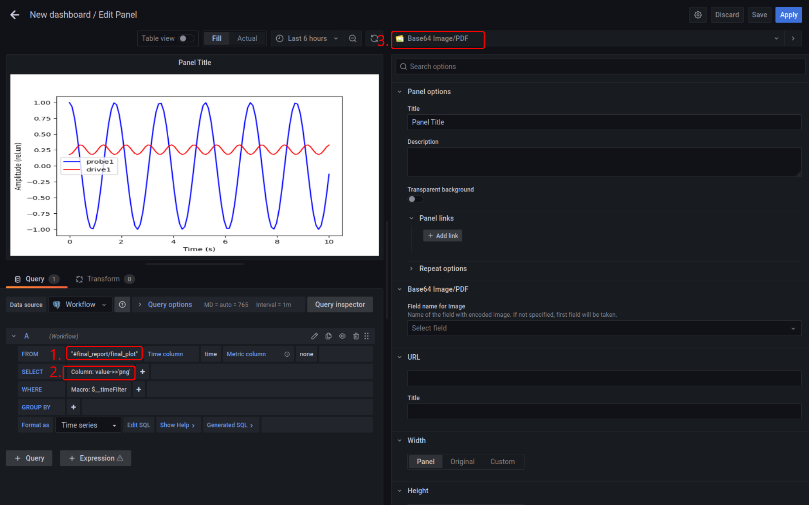
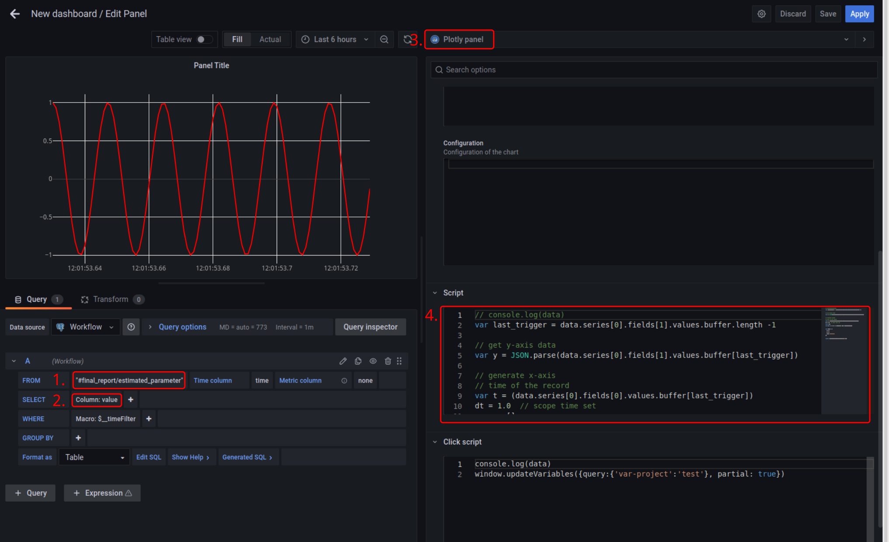
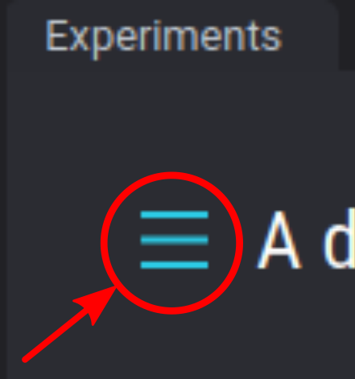
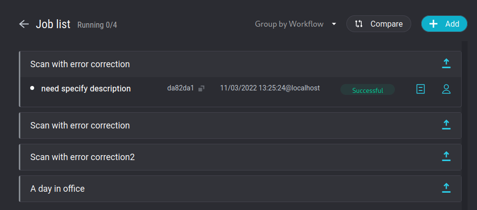

# Observability

Entropy Hub gives you observability on node level (for tracking and debugging
individual parts of the system), workflow level (for tracking and debugging
system-level issues), and also on the level of the results of the individual
nodes, both through real-time dashboard for result tracking during the
execution, and the previous experimental record. Finally, you can track the
status of job queues, where each job consists of the workflow and parameters.

## Workflow status

Workflow graph view with push notifications...

## Real-time outputs dashboard

Real-time, human-in-the-loop, tracking of progress of the experiment through
node outputs can be done from **Dashboard** panel in Entropy-hub menu that by
default opens Grafana plug-in. Note that only node outputs with retention `1` or
`2` will be visible (
[check nodeio retention rules here](../nodeio/overview.md#node-outputs) ).

You can save pre-configured dashboard easily once you create them. Each
dashboard consists of one or several panels, that use different visualisation
plugins. You can also setup alarms.

### Custom plot generated by your favourite plotting library

If you have a custom plotting as a part of your workflow, you can show this in
the dashboard simply if you export the plot as base64 encoded binary image. In
example below we export custom `matplotlib` plot as .png as a part of the JSON
dictionary output under `png` field.

```python hl_lines="25-29"

# nodeio code preceeds...

import numpy as np
import matplotlib.pyplot as plt
import io
import base64

while nodeio.status.active:
    a = input.get("data")

    # some code ...

    # do some custom plot
    x = np.linspace(0, 10, 100)
    y = np.cos(a * x / 10)
    plt.figure()
    plt.plot(x, y, "b-")
    plt.plot(x, np.cos(y) / 3, "r-")
    plt.xlabel("Time (s)")
    plt.ylabel("Amplitude (rel.un)")
    plt.legend(["probe1", "drive1"])

    buffer = io.BytesIO()

    plt.savefig(buffer, format="png")

    buffer.seek(0)
    figure_base64_encoded_png = base64.b64encode(buffer.read()).decode()
    output.set(final_plot={"png": figure_base64_encoded_png})
```

You can get that plot in Dashboard by (1) selecting that node output as a data
source and (2) using `value->>'png'` query (note double `>>` in the query) to
obtain directly base64 encoded plot (switch to Table view to verify this). (3)
This can be then shown using `Base 64 Image/PDF` plugin



!!! Info More complex JSON queries

    Check [PostgreSQL JSON operators](https://www.postgresql.org/docs/12/functions-json.html)
    for further options when quering JSON.

### Generate plot of triggered waveform

If you have a triggered scope, that delivers to you trace readout after every
trigger, and you want to visualise this data in the dashboard. For example your
node output is

```python hl_lines="11"
# nodeio code preceeds...

import numpy as np

while nodeio.status.active:
    a = input.get("data")

    # simulate osciloscope data input
    x = np.linspace(0, 10, 100)
    y = np.cos(a * x / 10)
    output.set(estimated_parameter=y.tolist())
```

You can select that data and use the Plotly panel option, with, as an example,
the following code under `Script` option for Plotly to obtain latest output and
regenerate time-axis with times step `dt=0.1` seconds.



Script code (4. on the image above):

```js
// console.log(data)
var last_trigger = data.series[0].fields[1].values.buffer.length - 1;

// get y-axis data
var y = JSON.parse(data.series[0].fields[1].values.buffer[last_trigger]);

// generate x-axis
// time of the record
var t = data.series[0].fields[0].values.buffer[last_trigger];
dt = 1.0; // scope time set
var x = [];
for (var i = 0; i < y.length; i++) x.push(t + i * dt);

var trace = {
  x: x,
  y: y,
};

return { data: [trace], layout: { title: "" } };
```

!!! Info

    Many more advanced plotting styles and options are supported through standard
    Plotly.js methods. Check [panel documentation](https://grafana.com/grafana/plugins/ae3e-plotly-panel/) as well as [Plotly.js documentation](https://plotly.com/javascript/plotly-fundamentals/).

## Job queues and status

{ align=right width=100}

Past jobs and job status can be seen by clicking on the burger icon from the
Experiments panel top left corner.

The job list that opens is grouped by workflows. Clicking on a particular
workflow expands that workflow and shows jobs that run with that workflow.


