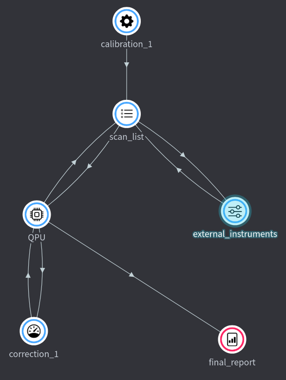

# Workflow

{ align=right width=250}

Workflow allows you to write an experimental workflow as a story in a code that
reads like a prose. You can keep thinking at high level how you want to
orchestrate your experiment with everything you need — all documentation of
different modules, and inputs and outputs specifications — available on demand
thanks to usual auto-completion features provided by IDE. No matter what is your
programming languages of choice for writing nodes, you have a single place to
control them all, as a code. You can use as little or as much Python as you want
in authoring the experiment, keeping it to bare minimum that is almost only
consisting of problem-specific names defined by you, or use full-blown Python
for efficient programmatic generation of large complex workflows.

!!! Note

    When using **Entropy Hub**, code for nodes and workflows can be edited in
    **Experiments** panel with **Code** view turned on.

## Defining workflow

Workflow is specified as a Python file that in general looks like

```python

from entropylab.flame.workflow import Workflow
import entropynodes.library as expNodes

# 1. Define workflow

wf = Workflow("A day in office", description="What happens in local office")

# 2. START workflow

boss = expNodes.GrumpyAdministrator("boss")
clerk = expNodes.CheerfulNode("clerk", customer=boss.o.clerk_request)
boss.i.clerk_salary = clerk.o.requested_salary

wf.register() # 3. END and register workflow
```

To define workflow we import Workflow from `entropylab.workflow` and define its
name and longer description. All the processing nodes, that we defined using
`NodeIO` and run them individually, are available as `entropynodes.library`. In
the example above we import those as `expNodes`.

We then proceed by describing workflow. We make instances of processing nodes,
give them unique name that will help us later track them in the workflow view,
and connect their inputs and outputs. Note that there can be many instances of a
node defined under `expNode`. Each instance will be running in parallel,
allowing parallel processing.

Inputs and outputs of the nodes are listed under `.i` and `.o` parameters
respectively. If you use IDE with Pylance like Visual Studio, provided
integrated in Entropy Hub, you will be able to see all possible inputs and
outputs as well as their description and units. Inputs of the nodes can be set
during creation of the instance: e.g. `customer=a.o.clerk_request` sets customer
input of node named `clerk` to output of `boss` node). Alternatively, they can
be set later on as we do when we pass a clerk's request for salary to the boss
`boss.i.clerk_salary = clerk.o.requested_salary`. Not all possible node inputs
have to be specified here: unresolved ones become parameters to be provided for
the specific run of this workflow, as we describe in the following.

## Parameters and run-time variables

Nodes that make up the workflow have inputs:

- Some of the inputs might be resolved _during_ the running of the workflow, by
  connecting outputs of other nodes: these are **run-time variables**.

- Other inputs will be specified by the user _before_ running of the workflow:
  these are **parameters**.

Once workflow is defined, user can execute in command line `workflow.py` file
that specifies workflow

```
python3 workflow.py
```

to automatically generate a list of all parameters of the workflow as a simple
JSON file `parameters.json`. This is a list of unresolved input values that have
to be specified before executing this workflow can be executed.

!!! note

    If there is existing `parameters.json` file that already specifies some of the
    values of the workflow, running `python workflow.py` will overwrite this file,
    but, it will try to reuse any values that were set in the old file, and write
    them also in the new file (as long as there is a match between some of the old
    and new node names and their variable names).

## Executing a workflow

### From command line

```
python3 -m entropylab.flame.execute
```

in general

```
usage: execute.py [-h] [-w WORKFLOW] [-p PARAMETERS] [-t MAX_EXECUTION_TIME] [-d STATUS_CHECK_INTERVAL]

Flame executor of parametrized workflows

optional arguments:
-h, --help show this help message and exit
-w WORKFLOW, --workflow WORKFLOW
Python file that defines main entropylab.Workflow (default workflow.py)
-p PARAMETERS, --parameters PARAMETERS
JSON file that resolves workflow parameters
-t MAX_EXECUTION_TIME, --max-execution-time MAX_EXECUTION_TIME
Maximal execution time in s
-d STATUS_CHECK_INTERVAL, --status-check-interval STATUS_CHECK_INTERVAL
Node status check interval in s (default 1 s)
```

### From user interface

There are two possible ways to submit a job (=workflow + parameters) for
execution:

Experiment > workflow view > Run

Experiment > Job list > Add

## Advanced topics

### Grouping nodes into different views

### Importing workflows into larger workflows

### Distributed workflows spanning multiple hosts
