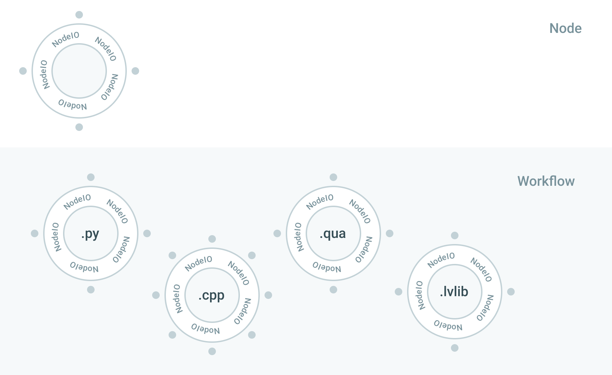

# Entropy

Entropy creates and manages workflows in a clean, modular manner, integrating
experimental hardware and computational resources. It ensures hardware
performance using natively distributed event-driven state-machine execution,
while user productivity is boosted with industry leading web-based interfaces.
Entropy is a modular, open-source solution that can be easily adopted and
expanded for orchestration of the most challenging experiments, instruments and
quantum processors.

Top level interface is provided by **Entropy Hub** applicatoin that allows every
step of control and execution to be authored, monitored, managed and
interrogated from the web interface, from any web browser on any device on the
shared local network. At the core of the sustem, allowing powerful and scallable
execution is **Entropy Flame** engine.

## Overview

Modern experiments and instruments, and in particular quantum computing
platforms, require integration of many software and hardware resources, in a
manner that will allow easy creation, maintenance, and scaling. Entropy
abstracts away architecture issues, and provides a simple framework where users
can focus on solving problems they know best. This is achieved by

- **Node I/O library**, that wraps individual modules that users can develop in
  their language of choice, providing a universal interface. It allows building
  and testing the modules independently of the rest of the system, and seamless
  high-performance integration of the module once it is run as a part of a
  bigger workflow, without changing anything in the user code. It also provides
  a very expressive way of describing events, data flows and states on which
  execution of such a module will depend.

- **Workflow library** is a fluent, expressive way to describe workflow of your
  experiment with very little Python code, very close to everyday language, with
  a dynamic documentation always at-hand for all your nodes.

With this you can easily orchestrate the whole experiment, using multiple
programming languages, platforms and heterogenous hardware. Execution is taken
care by the Entropy Flame, which will enable you also to easily find and debug
any problems that might occur during R&D of your experiment, to track real-time
operation, record notes and data, and easily find all information across the
system.

<figure markdown>
  
  <figcaption>Overview of Entropylab: NodeIO library provides universal interface to the code, and allows testing of individual modules. Individually tested nodes can be immersed in workflow, that is defined as a Python script, that defines interaction between the node actors. </figcaption>
</figure>

## Key features

- Natively distributed execution, connects heterogenous asynchronous systems:
  this is scalable solution with no bottlenecks
- Low-latency between nodes, bare-metal access
- Development of complex solutions module by module, and good observability of
  things that work as well as those that don't work and need debugging.
- Expressive user interface allows describing solution as a story narrative
- Management interface provided: jobs, notes and results are connected,
  persisted and versioned, accessible through enterprise-quality search.

## Example use-case

To-do: smart home IoT
