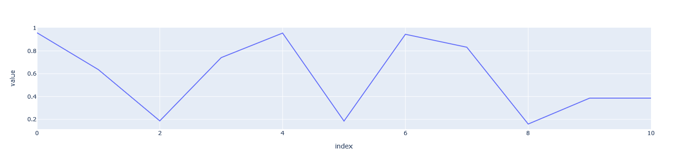

# Parameter Store

Storing and recalling experimental parameters is a crucially important task when running or analyzing experiments. 
The ParameterStore is a tool for storing parameter key-value pairs, very much like a python dictionary. 
Unlike a python dictionary, the paramstore has a mechanism for saving its state and reverting to previous states. 
This is a git-like versioning for your experimental parameters, because it allows you to commit a snapshot. That snapshot 
receives a unique identified, but in addition can be labeled with a non-unique text string. 

## InProcessParamStore
The paramStore interface is defined such that we can eventually have different implementations of varying complexity. 
We may wish to implement a paramstore with some powerful DB like mongoDB or PostgreSQL but for now, we have a simple text
based implementation. This first implementation is the `InProcessParamStore`. You can use it as follows

```python
from entropylab.api.in_process_param_store import InProcessParamStore
db_dir = ‘.’
db_name = ‘params.json’
db_path = os.path.join(db_dir, db_name)
params = InProcessParamStore(db_path)
params =InProcessParamStore()
```

If no path is supplied to the constructor of this class, no persistence will occur. Once the process dies, the param store dies. 
However, if a path is supplied a persistent json file `params.json` containing the DB will be generated in the current working directory.  
To initialize a paramstore in the current entropy directory, you can also initialize the paramstore as follows: 
```python
from entropylab.api.in_process_param_store import InProcessParamStore
params =InProcessParamStore('.')
```

## Storing and retrieving keys

Accessing keys in the paramstore can be done in one of two styles. The first is a dictionary style access:

```
params['a']=1
```

The second is a field (JavaScript-like) style
```
params.a=1
```

The nice thing about the second style is that by implementing this, we are able to provide autocompletion and by simply typing 
the name of the paramstore object followed by a period (.) all key names are suggested (when using a modern IDE).

## Tags
A key can be associated with a tag as follows 

```python
    params.add_tag(‘qubit1’, ‘a’)
```
Multiple tags can be associated with the same key:

```python
    params.add_tag(‘qubit1’, ‘b’)
```
Given the following paramstore:

```python
params = InProcessParamStore()

params.a=1
params.b=2
params.add_tag('qubit1','a')
params.add_tag('res_1','a')
params.add_tag('qubit1','b')


```
You can query for tags associated with a specific key as follows:

```python
params.list_tags_for_key('a')
```

Which should yield `['qubit1', 'res_1']`. Or query for a all keys associated with a tag as follows: 
```python
params.list_keys_for_tag('qubit1')
```

Which should yield `['a', 'b']`.


The tag mechanism allows the paramstore to have more structure. Instead of a flat key-value collection,
multiple keys can be combined. 


## Checkout and commit into the paramstore

If a paramstore has had changes applied to it since a last commit, it is in a dirty state. 

You can check this as follows: 

```python
params.new_key=1
params.is_dirty
```
This should evaluate to `True`. 

You can then commit changes by calling the method with a commit label: 
```python
params.commit('this is a label')
```
This returns the commit hash ID. 

You can then list the exiting commits  
```python
params.list_commits()
```
Which returns a list of commit Metadata objects.

Because the commit label need not be unique, revert to any previous commit is done using its unique ID.

Reverting to the most recent commit can be done, e.g. by: 

```python
params.checkout(params.list_commits()[-1].id)
```

## The temp commit

The paramstore has one special commit which can be used as a temporary store. 
This temporary state can be accessed by using

```python
params.save_temp()
```
or 

```python
params.load_temp()
```

If the paramstore is at a dirty state, saving to temp does not change this.

The temp state can be used as a means of state sharing between elements that use the paramstore and was mostly introduced to
facilitate the development of [QuAM](../quam/overview.md).

## Tracking a parameter across commits

As parameter values change across commits, and indeed across experimental steps and/or time, it's likely you would like to track them. 
Paramstore gives a convenient way to do this with the `list_values` methods. It returns all values of a key across commits in a pandas dataframe form.
This makes plotting particularly simple. 

```python
import plotly.express as px
import numpy as np 
params = InProcessParamStore()
for val in range(10):
    params.a=np.random.uniform()
    params.commit(f'{val}')
res = params.list_values('a')

px.line(res,y='value')
```
Which should give you a result resembling the following: 



## ParamStore and the entropy pipeline

A param store can be saved as a resource for an entropy graph. This allows usage of the paramstore to set parameters in different 
nodes of the experiment. 
Checkout of a commit that is appropriate to a specific node can be used to set parameters suitable for that node. 


