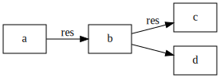
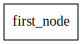
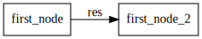

# Entropy pipeline: an experiment graph

An experiment is a set of steps which may or may not be directly dependent on each other. 
You may want to run steps (or not run them) based on the result of a previous step. 
You may want to run steps using a result from a previous step. And you will almost always need to have access to the
results each previous step had generated.

This model is well described by a Directed Acyclic Graph (DAG). Directed means there is a direction to the 
flow of the graph, from root to leaves. Acyclic means there shouldn't be closed loops in which you can get "stuck"
when flowing through the graph. DAG based authoring of experiments is perhaps the defining feature of Entropy. 
It's very much like running a data processing pipeline, which is why this section is called the entropy "pipeline".

A simple DAG is shown below. Each experimental stage can be placed in a separate node and nodes pass data to descendant 
nodes. This is marked as "res" on vertices in the image. Note how you can also set the node run order without passing 
data between nodes. For example, noded b and d have a vertex connecting them but no data is passed.

 

The data passed into, and out of nodes is automatically saved to the result handling backend (see below).
But we can also take advantage of the structure to do some pretty nifty things. A graph run can have branching logic 
(conditional execution of branches), can be parameterized and there can be more than one way to traverse a graph from 
one end to another. This last point is particularly important when you have a graph with one target node, 
including the algorithm you really want to run and many calibration nodes with the all the experimental prerequisites.
Solving the problem of complex calibration is actually the first task we had in mind for this project.

## Building your first graph

The PyNode is the basic element in an Entropy grpah. It runs arbitrary python code defined in the `program` parameter.
In the example below, the `program` is defined by the function `node_operation` which doesn't do anything but returns a 
dictionary with the key:value pair `{`res`:1}`. Programs used in PyNodes must always return a dictionary. 
The node also has a name, set by `label` and defined the names of the variables it (optionally) passes on to other nodes.

```python
def node_operation():
    return {'res':1}

node1 = PyNode(label="first_node", program=node_operation,output_vars={'res'})
```

You can now attach the node to a graph (containing just one node)

```python
experiment = Graph(resources=None, graph={node1}, story="run_a") 
```


There are some explanations in order here. You can see that this graph
has the `resources` parameter set to `None`, but we have not defined
resources yet. We also didn't say anything about the `story` associated
with a graph. But let's ignore that for now.

!!! warning

    If you don't add resources, no resutls are saved to the DB. 
    At the moment there is no default DB. 
    Tell us if you think this is the wrong choice, but we think it makes sense as sometimes you are just screwing around 
    in the lab. 

We can now run the graph, saving the results to `handle`

```.python
def node_operation():
    return {'res':1}

node1 = PyNode(label="first_node", program=node_operation,output_vars={'res'})
experiment = Graph(resources=None, graph={node1}, story="run_a") 
handle = experiment.run()
```

```
    2021-09-29 12:53:56,805 - entropy - WARNING - Results of current execution None will be permanently lost on session close
    2021-09-29 12:53:56,807 - entropy - INFO - Running node <PyNode> first_node
    2021-09-29 12:53:56,807 - entropy - INFO - Finished entropy experiment execution successfully
```

"What's with the `WARNING`?" you may ask. Because we didn't define
any `resources`, and we don\'t have a backend for result saving defined,
Entropy warns us we will not have any persistence (nothing will be saved
for posterity). We will address this issue soon. Regardless, while in
the python session, we can access the (wholly unspectacular) experiment
results as follows:

```.python
handle.results.get_results_from_node("first_node")[0].results[0].data

1

```

You can see the returned result is what was returned by
`node_operation`. There is clearly some structure here: results are
returned in a list, that list is made of a certain type of object and so
on. We will go into more detail later but will gloss over this for now.

To view the graph, you need to have `graphviz` installed ([installation
guide](https://graphviz.org/download/)). If it\'s properly installed on
your environment, you can view the graph as follows:

```.python
handle.dot_graph()
```




If not, you can use a textual representation of the graph. This is
called `dot` notation and is a standard way to serialize a graph. To
access the dot representation, run the following command

```.python
print(str(handle.dot_graph()))
```

```
    digraph {
    	graph [rankdir=LR]
    	first_node [shape=box]
    }
```

This string can then be pasted in a service such as
[GraphVizOnline](https://dreampuf.github.io/GraphvizOnline/) or
[Edotor](https://edotor.net/) to get the graphical representation.

## A graph with two nodes

As a graph with a single node is hardly a graph, here's an example
containing two nodes which pass a result between them.

For simplicity, both nodes are running the same operation (same
`node_operation` as before)

```.python
node1 = PyNode(label="first_node", program=node_operation,output_vars={'res'})
node2 = PyNode(label="first_node", program=node_operation,output_vars={'res'},input_vars={'ina':node1.outputs['res']})
experiment = Graph(resources=None, graph={node1,node2}, story="run_a") 
handle = experiment.run()
graph=handle.dot_graph()
graph.graph_attr['rankdir'] = 'LR'
graph
```




By inspecting the results object, we can see we have two `ResultRecord`s
coming from each of the nodes, and an additional one which is
automatically added. The additional record is the result of the final
node, and it is always included.

```.python
handle.results.get_results()
```

```
    [ResultRecord(experiment_id=1632909245982750200, id=0, label='res', story=None, stage=0, data=1, time=datetime.datetime(2021, 9, 29, 12, 54, 5, 984892)),
     ResultRecord(experiment_id=1632909245982750200, id=1, label='res', story=None, stage=1, data=1, time=datetime.datetime(2021, 9, 29, 12, 54, 5, 985904)),
     ResultRecord(experiment_id=1632909245982750200, id=2, label='experiment_result', story='Final output of the experiment', stage=-1, data={'res': 1}, time=datetime.datetime(2021, 9, 29, 12, 54, 5, 985904))]
```


## Results in Entropy: Setting up a DB

Collecting and arranging experimental data is a difficult task. It's
often managed in files and folders with some structure users agree upon,
but in many cases that is not enforced. To solve this problem we provide
a way to automate data saving as an integral part of structuring the
experimental sequence. Each node can save the data you specify, but also
saves additional data on its own.

Make sure you have an entropy project set up. You can do that by running the `init` CLI command. 
You can then create you db connection object as follows:
```.python
db = SqlAlchemyDB('.')

experiment_resources = ExperimentResources(db)
```
Running an experiment that saves something to the DB is now easy

```.python
node1 = PyNode("node_with_DB", node_operation,output_vars={'res'})
experiment_with_db = Graph(resources=experiment_resources, graph={node1},story="run with DB")
handle2 = experiment_with_db.run()
```

```
    2021-05-09 18:58:13,827 - entropy - INFO - Running node <PyNode> node_with_DB
    2021-05-09 18:58:13,884 - entropy - INFO - Finished entropy experiment execution successfully
```


If you now try to observe the saved results, what do you expect to see?

```.python
handle2.results.get_results()
```

```
    [ResultRecord(experiment_id=1, id=1, label='res', story=None, stage=0, data=1),
     ResultRecord(experiment_id=1, id=2, label='experiment_result', story='Final output of the experiment', stage=-1, data={'res': 1})]
```


Only the results of the last run are here. Even if you run this
experiments a few more times, you will only see the last run.

This is a bit disappointing as we promised persistence. So, what gives?

Well, the `handle` is just for a specific experimental run, so it makes
sense you only see the results of *that run*. To see everything in the
database you can query it directly

```.python
db.get_results()
```

```
    [ResultRecord(experiment_id=1, id=1, label='res', story=None, stage=0, data=1),
     ResultRecord(experiment_id=1, id=2, label='experiment_result', story='Final output of the experiment', stage=-1, data={'res': 1})]
```


And if we run the experiment a few more times, see how the DB is
populated

```.python
[experiment_with_db.run() for ind in range(10)]
db.get_results()
```

```
    2021-05-09 18:58:24,634 - entropy - INFO - Running node <PyNode> node_with_DB
    2021-05-09 18:58:24,709 - entropy - INFO - Finished entropy experiment execution successfully
    2021-05-09 18:58:24,725 - entropy - INFO - Running node <PyNode> node_with_DB
    2021-05-09 18:58:24,799 - entropy - INFO - Finished entropy experiment execution successfully
    2021-05-09 18:58:24,820 - entropy - INFO - Running node <PyNode> node_with_DB
    2021-05-09 18:58:24,872 - entropy - INFO - Finished entropy experiment execution successfully
    2021-05-09 18:58:24,886 - entropy - INFO - Running node <PyNode> node_with_DB
    2021-05-09 18:58:24,928 - entropy - INFO - Finished entropy experiment execution successfully
    2021-05-09 18:58:24,942 - entropy - INFO - Running node <PyNode> node_with_DB
    2021-05-09 18:58:24,988 - entropy - INFO - Finished entropy experiment execution successfully
    2021-05-09 18:58:25,000 - entropy - INFO - Running node <PyNode> node_with_DB
    2021-05-09 18:58:25,049 - entropy - INFO - Finished entropy experiment execution successfully
    2021-05-09 18:58:25,061 - entropy - INFO - Running node <PyNode> node_with_DB
    2021-05-09 18:58:25,108 - entropy - INFO - Finished entropy experiment execution successfully
    2021-05-09 18:58:25,120 - entropy - INFO - Running node <PyNode> node_with_DB
    2021-05-09 18:58:25,163 - entropy - INFO - Finished entropy experiment execution successfully
    2021-05-09 18:58:25,174 - entropy - INFO - Running node <PyNode> node_with_DB
    2021-05-09 18:58:25,221 - entropy - INFO - Finished entropy experiment execution successfully
    2021-05-09 18:58:25,234 - entropy - INFO - Running node <PyNode> node_with_DB
    2021-05-09 18:58:25,280 - entropy - INFO - Finished entropy experiment execution successfully
```
```
    [ResultRecord(experiment_id=1, id=1, label='res', story=None, stage=0, data=1),
     ResultRecord(experiment_id=1, id=2, label='experiment_result', story='Final output of the experiment', stage=-1, data={'res': 1}),
     ResultRecord(experiment_id=2, id=3, label='res', story=None, stage=0, data=1),
     ResultRecord(experiment_id=2, id=4, label='experiment_result', story='Final output of the experiment', stage=-1, data={'res': 1}),
     ResultRecord(experiment_id=3, id=5, label='res', story=None, stage=0, data=1),
     ResultRecord(experiment_id=3, id=6, label='experiment_result', story='Final output of the experiment', stage=-1, data={'res': 1}),
     ResultRecord(experiment_id=4, id=7, label='res', story=None, stage=0, data=1),
     ResultRecord(experiment_id=4, id=8, label='experiment_result', story='Final output of the experiment', stage=-1, data={'res': 1}),
     ResultRecord(experiment_id=5, id=9, label='res', story=None, stage=0, data=1),
     ResultRecord(experiment_id=5, id=10, label='experiment_result', story='Final output of the experiment', stage=-1, data={'res': 1}),
     ResultRecord(experiment_id=6, id=11, label='res', story=None, stage=0, data=1),
     ResultRecord(experiment_id=6, id=12, label='experiment_result', story='Final output of the experiment', stage=-1, data={'res': 1}),
     ResultRecord(experiment_id=7, id=13, label='res', story=None, stage=0, data=1),
     ResultRecord(experiment_id=7, id=14, label='experiment_result', story='Final output of the experiment', stage=-1, data={'res': 1}),
     ResultRecord(experiment_id=8, id=15, label='res', story=None, stage=0, data=1),
     ResultRecord(experiment_id=8, id=16, label='experiment_result', story='Final output of the experiment', stage=-1, data={'res': 1}),
     ResultRecord(experiment_id=9, id=17, label='res', story=None, stage=0, data=1),
     ResultRecord(experiment_id=9, id=18, label='experiment_result', story='Final output of the experiment', stage=-1, data={'res': 1}),
     ResultRecord(experiment_id=10, id=19, label='res', story=None, stage=0, data=1),
     ResultRecord(experiment_id=10, id=20, label='experiment_result', story='Final output of the experiment', stage=-1, data={'res': 1}),
     ResultRecord(experiment_id=11, id=21, label='res', story=None, stage=0, data=1),
     ResultRecord(experiment_id=11, id=22, label='experiment_result', story='Final output of the experiment', stage=-1, data={'res': 1})]
```
