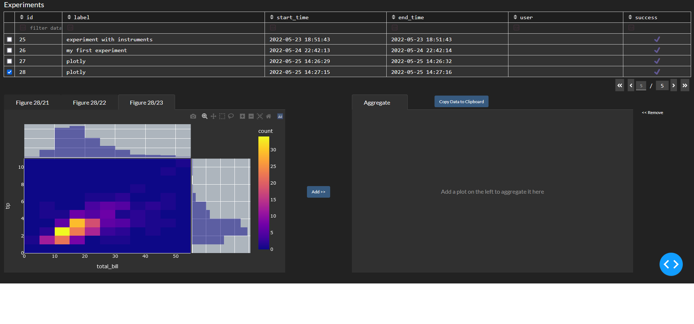

# plots in entropylab 

When you run a pipeline graph, you collect data which you may want to plot and show in the results browser.

`entropylab` supports the plots interface provided by plotly. 
This give you reponsive, rather than static, plots. In addition `plotly` plots are very easy to serialize so that
was technically superior to some alternatives. Additional plotting backends can and will be implemented later on. Tell
us which ones you are most keen on seeing. 

## Adding plots 

You can add as many plots as you'd like to the node.  

```python
import plotly.express as px

def node_operation(context:EntropyContext):

    fig1 = px.scatter([1,2,3,4])
    fig2 = px.scatter(np.sin(np.linspace(0,10,1000)))
    fig3 = px.density_heatmap(px.data.tips(), x="total_bill", y="tip", marginal_x="histogram", marginal_y="histogram")

    context.add_figure(fig1)
    context.add_figure(fig2)
    context.add_figure(fig3)
    
    return {'res': [1, 2, 10, 6]}

node1 = PyNode(label="first_node", program=node_operation, output_vars={'res'})

experiment = Graph(resources=labResources, graph={node1}, story="run_a",label="plotly")

experiment.dot_graph()
handle = experiment.run()

```

Each plot will appear as a separate tab in the entropy dashboard. 

 